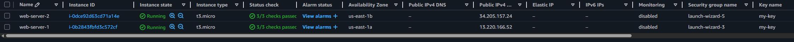
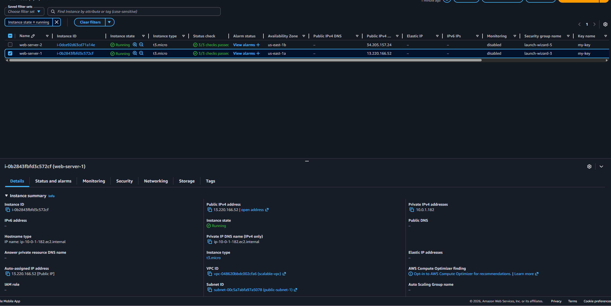
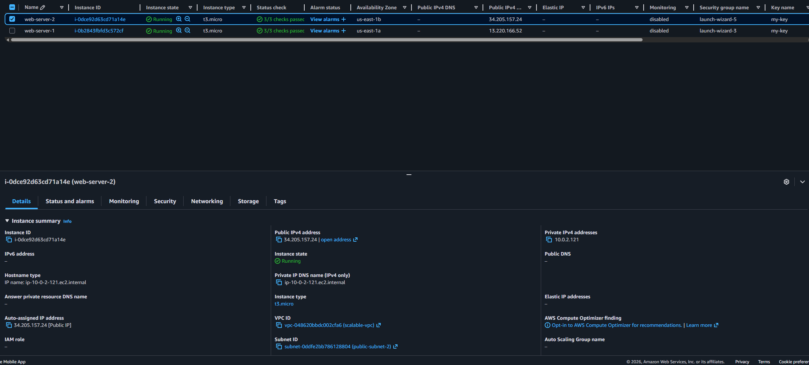
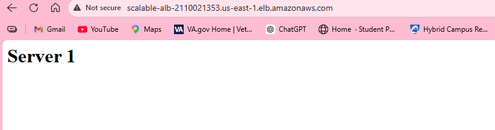

# AWS Scalable Web App Architecture

Designed and deployed a highly available and scalable web application infrastructure on AWS using EC2, VPC, and Application Load Balancer.

---

## Overview

This project demonstrates how to build a production-style cloud architecture that distributes traffic across multiple servers using a load balancer.

Instead of relying on a single server, this setup improves:
- Availability
- Fault tolerance
- Scalability

---

## Architecture

- Custom VPC (10.0.0.0/16)
- 2 Public Subnets (multi-AZ)
  - 10.0.1.0/24 (us-east-1a)
  - 10.0.2.0/24 (us-east-1b)
- Internet Gateway (IGW)
- Route Table with internet routing (0.0.0.0/0)
- 2 EC2 Instances (Apache Web Servers)
- Application Load Balancer (ALB)
- Target Group with health checks

---

## Architecture Diagram

---

## Load Balancing

The Application Load Balancer distributes incoming HTTP traffic across two EC2 instances.

---

## EC2 Instances

Two EC2 instances were deployed in separate Availability Zones for high availability.

---

## Target Group Health

Both instances are registered and healthy in the target group.

---

## Live Traffic Test

Verified load balancing by refreshing the Load Balancer DNS and observing alternating responses:

### Server 1

### Server 2

---

## 🔧 What I Did

- Created a custom VPC with defined CIDR block
- Designed and configured public subnets across multiple AZs
- Attached an Internet Gateway for external access
- Configured route tables for internet routing
- Launched and configured EC2 instances (Apache web servers)
- Created and configured a security group (HTTP & SSH)
- Built an Application Load Balancer
- Created a target group and registered EC2 instances
- Verified traffic distribution across multiple servers

---

## 🧠 Key Concepts Learned

- VPC and subnet design
- Public vs private networking
- Internet Gateway and routing
- EC2 provisioning and configuration
- Load balancing (ALB)
- Target groups and health checks
- Horizontal scaling fundamentals

---

## 📈 Future Improvements

- Implement Auto Scaling Group
- Add HTTPS (SSL/TLS with ACM)
- Move backend to private subnet
- Add RDS database layer
- Use user data scripts for automation

---

## 💡 Summary

This project simulates a real-world cloud architecture used in production environments, demonstrating scalable and fault-tolerant infrastructure design on AWS.
