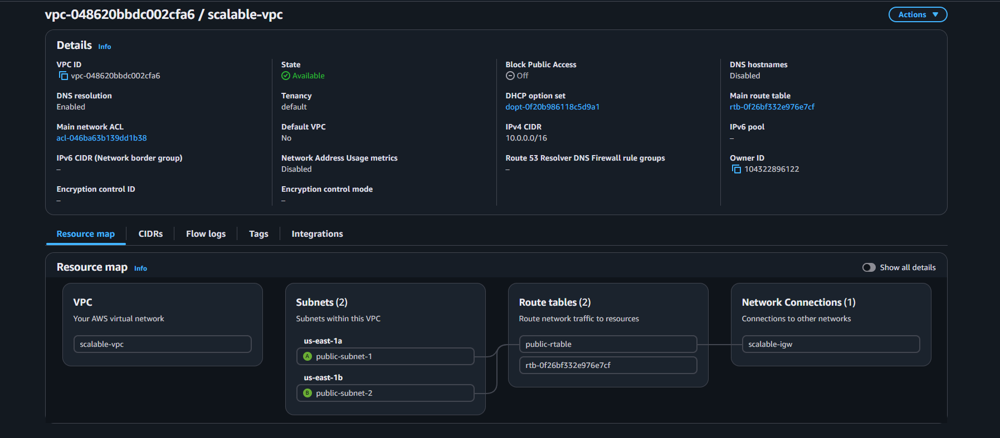
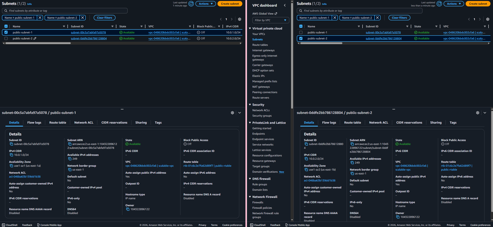
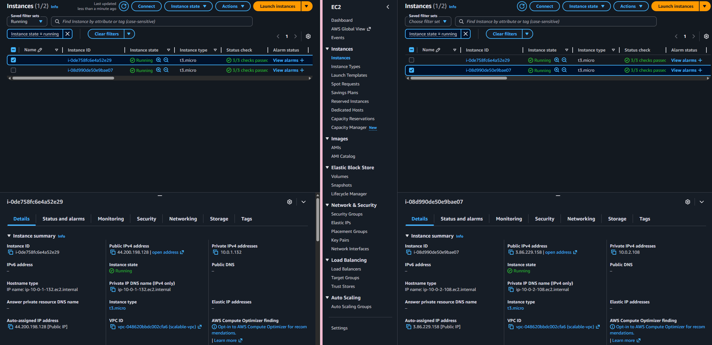
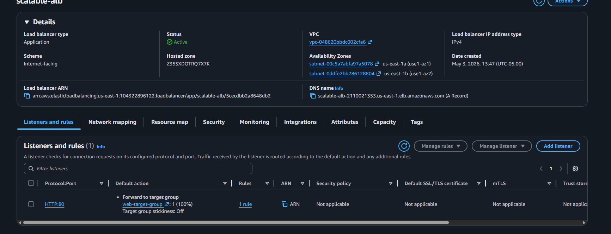
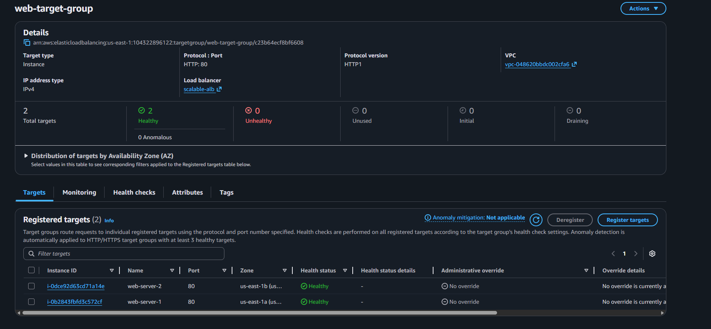
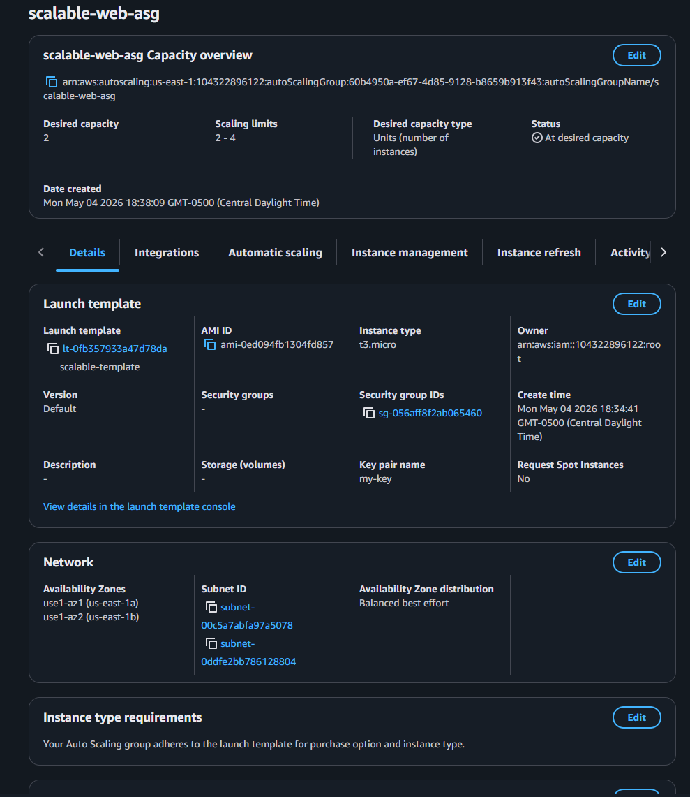

# AWS Scalable & Auto-Scaling Web Architecture

Designed and deployed a highly available, auto-scaling web architecture on AWS using EC2, Launch Templates, Application Load Balancer, and Auto Scaling Groups.

---

## Overview

This project demonstrates a production-style cloud architecture that distributes traffic across multiple servers and automatically scales based on demand.

Instead of relying on a single server, this setup provides:
- High availability
- Fault tolerance
- Horizontal scalability
- Self-healing infrastructure

---

## Architecture

- Custom VPC (10.0.0.0/16)
- 2 Public Subnets (Multi-AZ)
- 10.0.1.0/24 (us-east-1a)
- 10.0.2.0/24 (us-east-1b)
- Internet Gateway (IGW)
- Route Table (0.0.0.0/0 → IGW)
- Application Load Balancer (ALB)
- Target Group with health checks
- Launch Template (preconfigured EC2)
- Auto Scaling Group (ASG)
- Apache Web Server (via User Data)

---

## Load Balancing

The Application Load Balancer distributes incoming HTTP traffic across multiple EC2 instances running in different Availability Zones.

---

## Auto Scaling

The Auto Scaling Group ensures:

- Minimum of 2 instances always running
- Automatic replacement of failed instances
- Scaling out when CPU usage increases
- Scaling in when demand decreases

---

## User Data Automation

Each EC2 instance is automatically configured at launch using this script:

**
bash
#!/bin/bash
sudo dnf update -y
sudo dnf install httpd -y
sudo systemctl start httpd
sudo systemctl enable httpd
echo "<h1>Auto Scaled Server 🚀</h1>" > /var/www/html/index.html
**

## 📸 Screenshots

### VPC Architecture

### Subnets (Multi-AZ)

### EC2 Instances

### Load Balancer

### Target Group Health

### Auto Scaling Group

